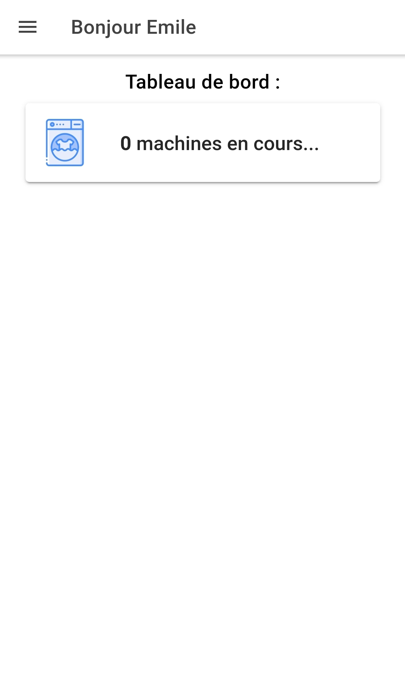
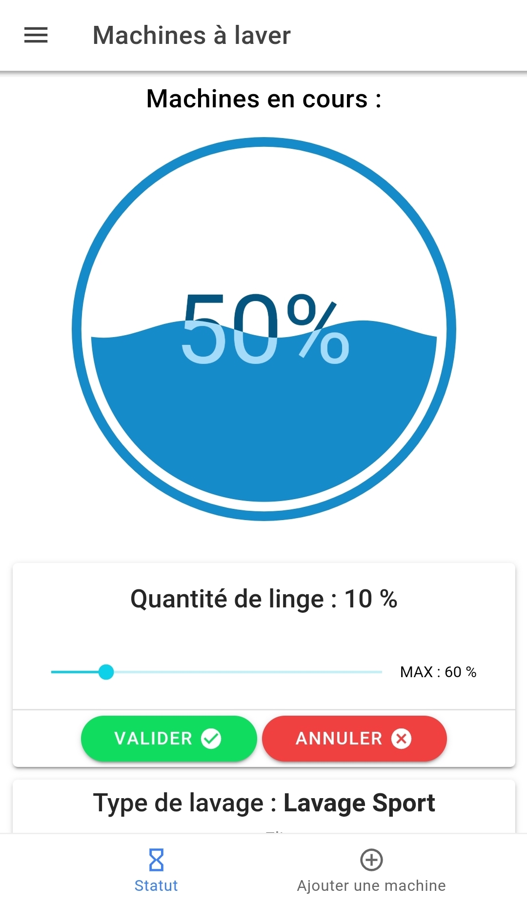

# DHOM

The name **DHOM** which refers to the begining of the french word __*domotique*__ (meaning home automation) and also to the word __*home*__ is the name of the infrastructure connecting all connected objects in my family's house.

This **DHOM app** is meant to be a way to facilitate any kind of household chores such as manage washing machine cycles in order to make sure everyone get his clothes washed on time.

The app was made using Ionic and the backend server, running on Heroku, using NodeJS.

 

## Features :
- Add several profiles corresponding to the members of the family.
- Schedule a washing machine and select the type of washing (sport, white...), the schedule time and day, and add a personalized message.
- View the machine currently planned and join it by adding your own laundry.

 

## Screenshot :

 | 
|:---:|:---:|

 | 
|:---:|:---:|

 | 
|:---:|:---:|
